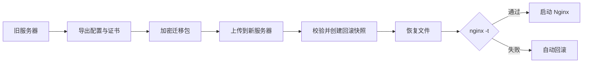

<div align="center">

# nginx-easy-deploy

**面向小型服务器与新手用户的原生 Nginx 一键部署、证书管理与迁移脚本**

不装面板，不接管系统，不运行数据库，也不常驻额外管理服务。

[](https://github.com/sanrokamlan-prog/nginx-easy-deploy)
[](https://github.com/sanrokamlan-prog/nginx-easy-deploy/actions/workflows/test.yml)
[](nginx-easy-deploy.sh)
[](LICENSE)

[快速开始](#快速开始) · [功能矩阵](#功能矩阵) · [命令参考](#命令参考) · [迁移服务器](#迁移服务器) · [安全设计](#安全设计)

</div>

---

`nginx-easy-deploy` 是一个可直接下载执行的 Bash 脚本。它使用系统软件源安装原生 Nginx，通过标准配置文件管理站点，并提供 HTTPS、Cloudflare、诊断、备份和跨服务器恢复能力。

脚本退出后，Nginx 仍按正常方式独立运行。所有站点仍可直接通过 `/etc/nginx` 维护，不存在面板停服后网站也无法管理的问题。

## 适合谁

| 需求 | 是否适合 |
| --- | :---: |
| 低配置 VPS，不想为面板预留内存 | 是 |
| 不熟悉 Nginx 配置，希望通过菜单部署站点 | 是 |
| 需要在两台服务器之间迁移配置和证书 | 是 |
| 希望保留标准 Nginx 配置，后续可以手动维护 | 是 |
| 需要管理 Docker、数据库、PHP 或完整主机环境 | 否 |
| 需要 WebUI、多用户权限或远程控制中心 | 否 |

## 快速开始

下载脚本后直接运行：

```bash
curl -fL \
  https://raw.githubusercontent.com/sanrokamlan-prog/nginx-easy-deploy/main/nginx-easy-deploy.sh \
  -o nginx-easy-deploy.sh

sudo bash nginx-easy-deploy.sh
```

首次进入会选择界面语言：

```text
请选择语言 / Select language
  1. 中文
  2. English
```

直接进入英文菜单：

```bash
sudo bash nginx-easy-deploy.sh --lang en
```

也可以使用环境变量，适合脚本调用：

```bash
sudo NGX_EASY_LANG=en bash nginx-easy-deploy.sh
```

> `--lang en` 是全局选项，需要写在具体命令前，例如 `sudo bash nginx-easy-deploy.sh --lang en status`。

## 双语交互菜单

中文和 English 菜单拥有完全相同的功能，输入 `L` 可以随时切换语言。

```text
============================================================
 nginx-easy-deploy - native Nginx deployment and migration
 No panel and no persistent management service
============================================================
  1. Install or repair Nginx + Certbot
  2. Create a reverse proxy site
  3. Create a static website
  4. Enable HTTPS for an existing site
  5. Request a Cloudflare DNS or wildcard certificate
  6. Upload and install a custom certificate
  7. List managed sites
  8. Diagnose the host and a domain
  9. Check local certificate expiry
 10. Refresh Cloudflare real visitor IP configuration
 11. Delete a site with a pre-delete backup
 12. Renew all certificates
 13. Export Nginx configuration and certificates
 14. Restore from a migration archive
 15. Show service status
 16. Apply optional conservative system tuning
 17. Back up and update Nginx
  L. Switch language / 切换语言
  0. Exit
```

## 功能矩阵

| 模块 | 能力 | 关键行为 |
| --- | --- | --- |
| 原生安装 | Nginx、Certbot、系统服务、防火墙 | 使用发行版软件源，不编译替换系统组件 |
| 站点部署 | 反向代理、静态网站、WebSocket | 生成独立 `conf.d` 配置，写入后执行 `nginx -t` |
| 自动 HTTPS | Let's Encrypt HTTP-01 | 自动申请、重定向 HTTPS、支持续签 |
| DNS HTTPS | Cloudflare DNS-01、通配符证书 | API Token 使用 `600` 权限保存，支持自动续签 |
| 自有证书 | 上传证书、私钥、独立证书链 | 检查格式、有效期、域名与公私钥匹配 |
| Cloudflare | 真实访客 IP、官方 IP 段更新 | 下载后校验，支持每周任务，不运行守护进程 |
| 诊断 | 系统、内存、端口、Nginx、DNS、公网 IP | 可在申请证书或迁移前快速排错 |
| 证书巡检 | 到期时间和风险等级 | 扫描 Nginx 当前实际引用的证书 |
| 删除保护 | 删除前备份配置和证书 | 静态文件可通过 `--backup-files` 一起保存 |
| 整机迁移 | 配置、证书、ACME 数据、可选站点文件 | 支持加密归档、校验和、恢复前快照与失败回滚 |
| 系统维护 | 保守调优、可选 BBR、Nginx 更新 | 调优可恢复，更新前自动完整备份 |

## 常用部署

### 反向代理

将 `app.example.com` 反向代理到本机 `3000` 端口，并申请 HTTPS：

```bash
sudo bash nginx-easy-deploy.sh proxy app.example.com 3000 \
  --email you@example.com
```

也可以填写完整上游地址：

```bash
sudo bash nginx-easy-deploy.sh proxy app.example.com \
  http://127.0.0.1:3000 \
  --email you@example.com
```

### 静态网站

```bash
sudo bash nginx-easy-deploy.sh static example.com \
  /var/www/example.com \
  --email you@example.com
```

只部署 HTTP：

```bash
sudo bash nginx-easy-deploy.sh proxy app.example.com 3000 --no-ssl
```

之后再启用 HTTPS：

```bash
sudo bash nginx-easy-deploy.sh ssl app.example.com you@example.com
```

## 证书管理

### 上传自有证书

使用 `fullchain.pem` 和 `privkey.pem`：

```bash
sudo bash nginx-easy-deploy.sh cert example.com \
  /root/certs/fullchain.pem \
  /root/certs/privkey.pem
```

证书和中间证书链分开时：

```bash
sudo bash nginx-easy-deploy.sh cert example.com \
  /root/certs/cert.pem \
  /root/certs/privkey.pem \
  --chain /root/certs/chain.pem
```

证书会安装到 `/etc/nginx/ssl/<域名>/`。自有证书不会由 Certbot 自动续签，到期前需要重新执行 `cert` 命令。

### Cloudflare DNS 通配符证书

适合以下场景：

- 需要 `*.example.com` 通配符证书
- 域名开启了 Cloudflare 代理
- 80 端口无法从公网访问

创建仅允许目标区域 `Zone:DNS:Edit` 的 Cloudflare API Token，并准备凭据文件：

```ini
dns_cloudflare_api_token = YOUR_API_TOKEN
```

申请根域名和通配符证书：

```bash
chmod 600 cloudflare.ini

sudo bash nginx-easy-deploy.sh dns-ssl example.com \
  you@example.com \
  cloudflare.ini \
  --wildcard
```

凭据会以 `600` 权限保存到 `/etc/letsencrypt/cloudflare/`，供 Certbot 自动续签。Token 值不会出现在进程参数或日志中。

### 到期巡检与续签

```bash
sudo bash nginx-easy-deploy.sh certs
sudo bash nginx-easy-deploy.sh renew
```

## Cloudflare 真实访客 IP

Cloudflare 代理开启后，源站默认看到的是 Cloudflare 节点 IP。执行：

```bash
sudo bash nginx-easy-deploy.sh cf-realip
```

脚本会从 Cloudflare 官方地址下载 IPv4/IPv6 网段，完成格式校验后生成 Nginx `real_ip` 配置。

安装每周更新任务：

```bash
sudo bash nginx-easy-deploy.sh cf-realip --schedule
```

删除脚本管理的配置和任务：

```bash
sudo bash nginx-easy-deploy.sh cf-realip --remove
```

每周任务由系统定时执行，不会启动常驻进程。

## 迁移服务器



旧服务器导出：

```bash
sudo bash nginx-easy-deploy.sh export --encrypt
```

将生成的 `.tar.gz.enc` 和本脚本上传到新服务器，然后恢复：

```bash
sudo bash nginx-easy-deploy.sh restore \
  ngx-migrate-host-date.tar.gz.enc
```

默认包含：

- Nginx 主配置和所有已加载的 include 文件
- 配置引用的证书、私钥、DH 参数和密码文件
- `/etc/letsencrypt`、Certbot 续签数据和 acme.sh 目录
- Nginx systemd override 与日志轮转配置
- Nginx 版本、编译参数、系统和软件包清单

静态站点文件默认不打包。需要同时迁移时：

```bash
sudo bash nginx-easy-deploy.sh export --encrypt --with-webroot
```

添加其他目录：

```bash
sudo bash nginx-easy-deploy.sh export --encrypt \
  --include /srv/my-site
```

恢复前，新服务器原有文件会保存到：

```text
/var/backups/ngx-migrate/pre-restore-YYYYMMDD-HHMMSS.tar.gz
```

## 命令参考

### 站点与证书

| 命令 | 作用 |
| --- | --- |
| `install` | 安装或修复 Nginx 与 Certbot |
| `proxy DOMAIN UPSTREAM` | 创建反向代理站点 |
| `static DOMAIN ROOT` | 创建静态网站 |
| `ssl DOMAIN EMAIL` | 为已有站点启用 Let's Encrypt |
| `cert DOMAIN CERT KEY` | 安装自有证书 |
| `dns-ssl DOMAIN EMAIL FILE` | 使用 Cloudflare DNS 申请证书 |
| `sites` | 查看脚本管理的站点 |
| `delete DOMAIN` | 删除站点并保留删除前备份 |
| `renew` | 续签全部 Certbot 证书 |
| `certs` | 检查当前 Nginx 证书到期时间 |

### 诊断、维护与迁移

| 命令 | 作用 |
| --- | --- |
| `doctor [DOMAIN]` | 检查系统、Nginx、端口和 DNS |
| `status` | 查看 Nginx 与 Certbot 状态 |
| `cf-realip` | 更新 Cloudflare 真实 IP 配置 |
| `tune [--bbr]` | 应用保守系统调优，BBR 默认关闭 |
| `tune --restore latest` | 恢复最近一次调优前状态 |
| `update` | 完整备份后更新 Nginx |
| `export` | 导出配置、证书和相关数据 |
| `restore ARCHIVE` | 校验并恢复迁移包 |

查看完整参数：

```bash
sudo bash nginx-easy-deploy.sh --help
sudo bash nginx-easy-deploy.sh --lang en --help
```

## 安全设计

| 风险 | 处理方式 |
| --- | --- |
| 写入错误配置 | 每次变更后执行 `nginx -t`，失败恢复原文件 |
| 覆盖用户配置 | 只自动删除带脚本管理标记的站点 |
| 迁移包被篡改 | 归档内包含 SHA-256 校验清单 |
| 私钥泄漏 | 支持 AES-256-CBC + PBKDF2 加密迁移包 |
| 恢复失败 | 替换文件前创建快照，异常时自动回滚 |
| Cloudflare Token 泄漏 | 不放入命令参数，凭据目录和文件限制权限 |
| 删除站点误操作 | 删除前持久备份配置与证书 |
| 调优影响系统 | 只提高偏低参数，支持恢复，BBR 需要主动启用 |
| 更新导致配置丢失 | 更新 Nginx 前自动执行完整导出 |

> 未加密的迁移包包含 TLS 私钥。跨网络传输时应使用 `export --encrypt`。

## 文件与系统影响

脚本不是面板，也不会安装自己的后台服务。常见写入位置如下：

```text
/etc/nginx/conf.d/ngx-easy-*.conf
/etc/nginx/ssl/<domain>/
/etc/letsencrypt/
/var/backups/nginx-easy-deploy/
/var/backups/ngx-migrate/
```

只有主动执行 `cf-realip --schedule` 时，才会添加每周更新任务；只有主动执行 `tune` 时，才会写入脚本专用的 sysctl 与 systemd override。

## 支持范围

主要支持：

- Debian / Ubuntu
- CentOS / RHEL
- Rocky Linux / AlmaLinux
- 使用 systemd 的原生 Nginx

脚本中也包含 `apk` 和 `zypper` 软件包分支，但建议先在非生产环境验证。

明确不处理：

- Docker 与 Kubernetes 内的 Nginx
- Nginx Proxy Manager、宝塔等面板定制环境
- PHP、数据库、反代目标应用和容器数据
- DNS 记录迁移
- OpenResty 二进制安装

OpenResty 配置可以导出，但新服务器需要提前安装兼容版本。

## 可选快捷命令

默认直接运行下载的脚本即可，不需要安装到系统命令。

确实希望以后输入 `nginx-easy-deploy` 时，可以自行复制到 PATH：

```bash
sudo install -m 755 nginx-easy-deploy.sh \
  /usr/local/sbin/nginx-easy-deploy

sudo nginx-easy-deploy
```

这只是可选快捷方式，不影响任何核心功能。

## 常见问题

<details>
<summary><strong>为什么不用 WebUI 面板？</strong></summary>

面板适合集中管理大量服务，但会增加常驻进程、数据库、升级链路和安全入口。这个项目只解决原生 Nginx 的部署、证书和迁移问题，适合资源有限或希望保持系统简单的服务器。

</details>

<details>
<summary><strong>脚本运行结束后网站还会继续工作吗？</strong></summary>

会。脚本只写入标准 Nginx 配置并管理系统服务，不需要脚本常驻。

</details>

<details>
<summary><strong>迁移会包含网站程序和数据库吗？</strong></summary>

默认只迁移 Nginx、证书与 ACME 数据。静态目录可以通过 `--with-webroot` 或 `--include` 添加；数据库、Docker 容器和反代应用需要单独迁移。

</details>

<details>
<summary><strong>可以迁移宝塔或 Nginx Proxy Manager 吗？</strong></summary>

不建议。它们通常包含面板专用路径、模板和运行时依赖。本项目面向标准的原生 Nginx 环境。

</details>

## 开发与测试

```bash
bash -n nginx-easy-deploy.sh tests/test_helpers.sh
bash tests/test_helpers.sh
```

每次推送都会通过 GitHub Actions 检查 Bash 语法、辅助函数、双语帮助和版本接口。

## License

[MIT](LICENSE)
